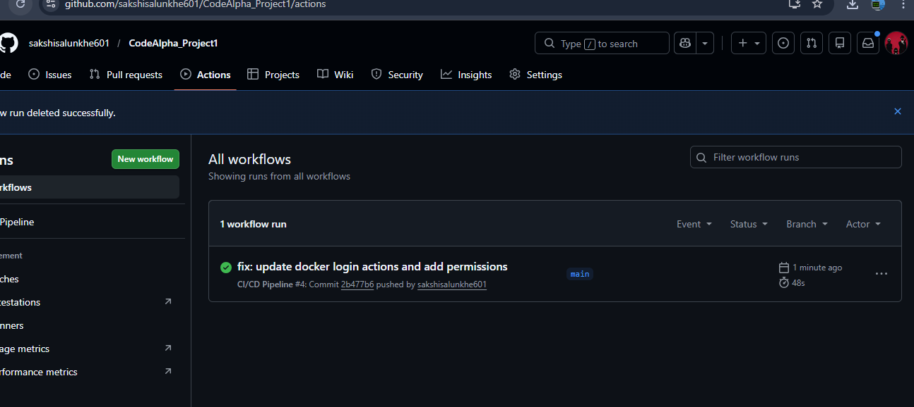
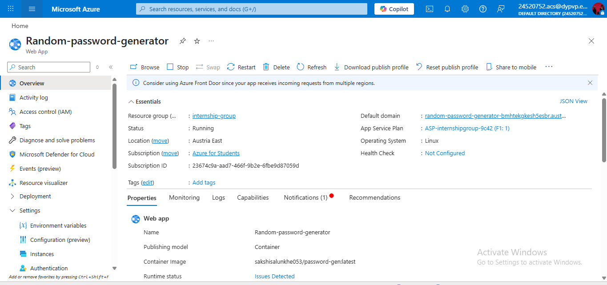

# 🚀 Cloud-Native CI/CD Pipeline | CodeAlpha Internship

## **📌Random Password Generator**

A fully automated, production-ready CI/CD pipeline built for the CodeAlpha DevOps Internship. This project demonstrates the seamless integration of source control, containerization, and cloud orchestration to deploy a high-availability Flask application.

## **🌐 Live Demo**
Access the Application: [Random Password Generator (Click Here)](https://random-password-generator-bmhtekgkesh5esbr.austriaeast-01.azurewebsites.net/)

## **🏗️ Architecture & Workflow**

The pipeline automates the entire lifecycle from code commit to cloud deployment:

**1) Continuous Integration (CI):**
* Checkout: GitHub Actions retrieves the latest code on every push to main.
* Dockerize: Application is packaged into a lightweight Docker image using the Dockerfile.
* Image Registry: The image is tagged and pushed to Docker Hub (sakshisalunkhe053/password-gen).

**2) Continuous Deployment (CD):**

* Azure Hook: A webhook triggers Azure App Service to pull the updated image.
* Zero-Downtime: Azure restarts the containerized environment to reflect changes instantly.

---

## **🛠️ Tech Stack**

|Category | Technology|
|:---:| :---:|
|Language |Python(Flask)|
|Containerization |Docker|
|Source Control |GitHub|
|CI/CD Orchestration |GitHub Actions|
|Container Registry| Docker Hub|
|Cloud Hosting |Microsoft Azure (App Service)|

---

## **📸 Project Images.** 

**1) Live Web Application**

 

**2) GitHub Actions Pipeline (Success)**

 
 
**3) Docker Hub Repository**
 

**4) Azure App Service Deployment**
 

----

## **🚀 Local Deployment**

To run this containerized application locally:

**1. Clone the repository**
git clone https://github.com/sakshisalunkhe601/CodeAlpha_Project1.git

**2. Build the Docker image**
docker build -t password-gen .

**3. Launch the container**
docker run -p 5000:5000 password-gen
Navigate to http://localhost:5000 in your browser.
 
---

### **📂 Repository Structure**

PlaintextCodeAlpha_Project1/
├── .github/workflows/
│   └── main.yml        # The "Brain": CI/CD Pipeline Definition
├── static/             # CSS & UI Styling
├── templates/          # Jinja2 HTML Templates
├── app.py              # Flask Backend Logic
├── Dockerfile          # Image Blueprint
├── requirements.txt    # Python Dependencies
└── README.md           # Project Documentation

---

### **🎓 Internship Milestones**
✅ Repository Naming: CodeAlpha_Project1
✅ Automation: Fully functional GitHub Actions Workflow.
✅ Containerization: Public Docker Hub repository maintained.
✅ Cloud Presence: Live deployment on Microsoft Azure.

---

### **🤝 Connect with Me on LinkedIn**
[Sakshi Salunkhe DevOps Intern @ CodeAlpha](www.linkedin.com/in/sakshi-salunkhe-758005319)